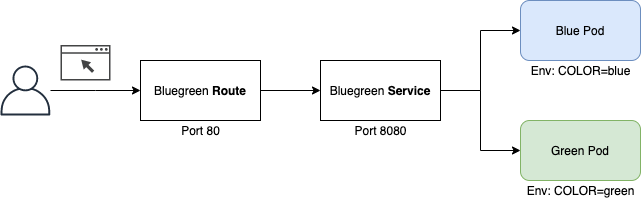

# Introduction

This repository will add Istio features to our basic [bluegreen application](https://github.com/atiouajni/bluegreen).
We will be able to demonstrate some features from Istio like :

- Traffic management
- Security
- Policies
- observability

# Architecture

<p align="center">

</p>

# Requirements

- Openshift 4.5+ (Installed and configured)
- oc cli

# Setup

Please follow the steps of [Installing Red Hat Service Mesh](https://docs.openshift.com/container-platform/4.5/service_mesh/service_mesh_install/installing-ossm.html#ossm-operator-install-elasticsearch_installing-ossm) which consists in :

- Installing Elasticsearch Operator
- Installing Jaeger Operator
- Installing Kiali Operator
- Installing Red Hat OpenShift Service Mesh Operator
- Creating and configuring a Service Mesh Control Plane

```shell
# istio-system is used as a namespace
oc apply -f istio-manifests/ServiceMeshControlPlane.yaml
```


# Installation
## I - Build bluegreen application

Follow [bluegreen application](https://github.com/atiouajni/bluegreen#installation) installation process.
  
## II - Deploy bluegreen application

**1 - Clone the project**

```shell
git clone https://github.com/atiouajni/bluegreen-istio
cd bluegreen-istio
```

**2 - Deploy a Blue and Green applications**

In this section we will deploy 2 Pods containing sidecar.istio.io/inject=true annotation to enable automatic sidecar injection.

```shell
oc apply -f openshift-manifests/php-istio/
```

**3 - Create ServiceMeshMemberRoll resources**

This custom resource will tell to Istio controller to monitor bluegren namespace 
```shell
oc apply -f istio-manifests/ServiceMeshMemberRoll.yaml
```

**4 - Retrieve the Istio ingress gateway address**

```shell
export GATEWAY_URL=$(oc -n istio-system get route istio-ingressgateway -o jsonpath='{.spec.host}')
echo  $GATEWAY_URL

```

**5 - Create Istio Gateway, VirtualService and DestinationRule**

```shell
#This command replaces the default host address with your gateway address
sed -i ''  's/HOST_TO_BE_REPLACED/'"$GATEWAY_URL"'/g' istio-manifests/Gateway.yaml

oc apply -f istio-manifests/Gateway.yaml
oc apply -f istio-manifests/DestinationRule.yaml
oc apply -f istio-manifests/VirtualService-LoadBalancing-70-30.yaml
```

**6 - Access the bluegreen app from Istio gatway**

```shell
curl -o /dev/null -s -w "%{http_code}\n" http://$GATEWAY_URL/image.php
```

> Bravo ! You just unlocked the next level. Please check the [#Usage](#Usage) section before going ahead.

# Usage  

## Once Istio is enabled

**You can demonstrate the distribution of traffic according to "weight"**

if you look at the **VirtualService** resource, it describes a load balancing strategy with different weights. 70% of requests will go to the blue app, the remaining 30% will go to the green app.

```shell
#Check the percentage distribution
#Respy is a tool provided in the basic bluegreen application
watch -p ./respy --c 10 --n 100 --u http://$GATEWAY_URL/color.php
````


# Cleanup

```shell
oc delete project bluegreen
oc delete project istio-system
  
#Check the current version of the subscribed Operators
oc get subscription jaeger-product -n openshift-operators -o yaml | grep currentCSV
oc get subscription kiali-ossm -n openshift-operators -o yaml | grep currentCSV
oc get subscription servicemeshoperator -n openshift-operators -o yaml | grep currentCSV
oc get subscription elasticsearch-operator -n openshift-operators-redhat -o yaml | grep currentCSV
  
#Delete these operators
oc delete subscription <operator-name> -n <namespace>
```

# Documentation

More details will be found in ./docs folder.

# Released versions

In progress...
